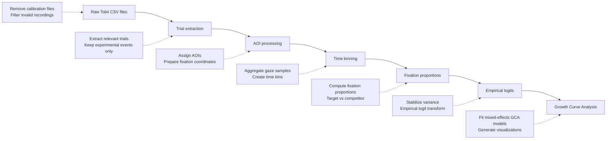

# Gender Bias in Visual Word Processing

## Overview

This repository contains the preprocessing pipeline, statistical analyses, and visualizations for a Visual World Paradigm (VWP) eye-tracking study investigating the interaction between grammatical gender, prestige, voice, and participant gender during online referent processing in Serbian.

The project uses Growth Curve Analysis (GCA) in R to model gaze trajectories over time.

---

## Project Workflow


---

## Repository Structure

```text
project/
│
├── README.md
│
├── data/
│   └── example/
│
├── scripts/
│   ├── 01_data_cleaning.R
│   ├── 02_trial_processing.R
│   ├── 03_time_binning.R
│   ├── 04_empirical_logits.R
│   ├── 05_gca_analysis.R
│   └── 06_visualization.R
│
├── figures/
│
└── results/
```

---

## Methods

### Experimental Paradigm

- Visual World Paradigm (VWP)
- Tobii Eye Tracker 5
- Serbian nominal agent forms

### Statistical Analysis

Analyses were conducted in R using:

- Growth Curve Analysis (GCA)
- Linear mixed-effects models
- Orthogonal time polynomials
- Empirical logit transformation

Main packages:

```r
library(tidyverse)
library(lme4)
library(lmerTest)
library(ggplot2)
```

---

## Reproducing the Analysis

Run scripts in the following order:

1. `01_data_cleaning.R`
2. `02_trial_processing.R`
3. `03_time_binning.R`
4. `04_empirical_logits.R`
5. `05_gca_analysis.R`
6. `06_visualization.R`

---

## Example Data

For repository size and privacy reasons, only example datasets are included.

The `data/example/` directory contains small representative samples demonstrating the structure of the original data.

---

## Example Output

Example trajectory plots and statistical outputs are available in:

```text
figures/
results/
```

---

## Author

Sara Barać

Faculty project repository.