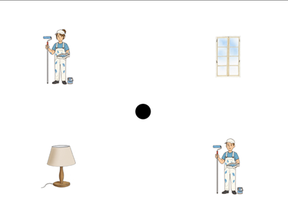
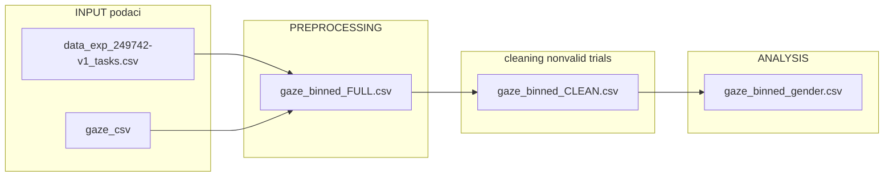
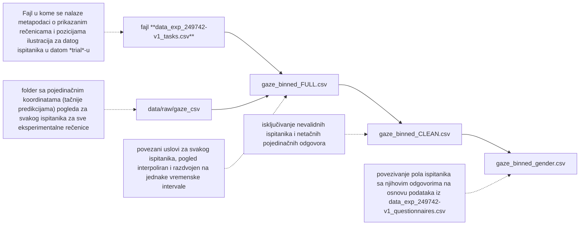
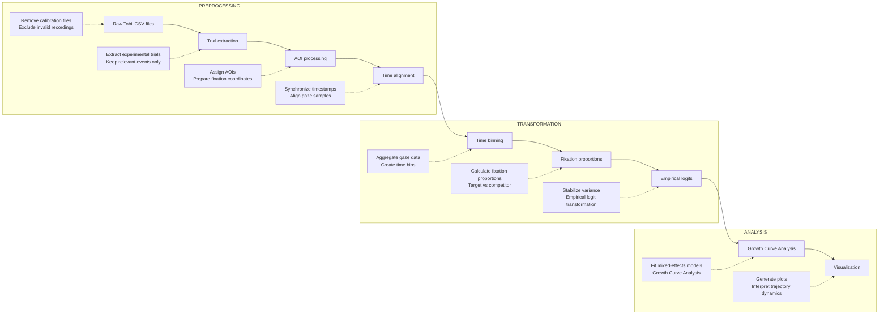

# Predikcije tokom kognitivne obrade muških i ženskih nomina agentis u srpskom jeziku – na preseku pola, roda i prestižnosti

## Sažetak projekta

Ovaj projekat predstavlja analizu podataka prikupljenih u okviru istraživanja sprovedenog u Istaživačkoj stanici Petnici krajem 2025. godine. 
Sprovedeno je od strane polaznice Sare Tešić, pod mentorstvom Sare Barać i stručne naučne konsultantkinje dr Bojane Ristić. 

Sprovedena je longitudinalna analiza **(Growth Curve Analysis)** sa ciljem utvrđivanja:

Kako:
1)  pol ispitanika
2)  rod imenice 
3)  glas kojim se imenica predstavlja 
4)  prestižnost predstavljenog zanimanja 

i(li) međusobna interakcija ovih faktora

utiču na pokrete očiju ispitanika govornika_ca srpskog jezika?

## Teorijsko-metodološka pozadina  

📌 Psiholingvistička pilot-studija na srpskom jeziku, zasnovana na prethodnim istraživanjima koja pokazuju da pokreti očiju oslikavaju obradu jezika

📌 Materijal: **12** rečenica sa imenicom nomino agentis u (a) muškom rodu, (b) ženskom rodu, koje su (6) prestižnih zanimanja i (6) neprestižnih zanimanja, svih pročitanih i muškim i ženskim glasom. 
Ukupan materijal latinskim kvadratom raspoređen u dve verzije eksperimenta. 

primer stimulusne rečenice: *Akvarijum će pre godišnjeg napuniti bibliotekar.*

📌 Podaci prikupljeni u softveru za praćenje pokrera očiju u *broswer*-u (na bazi *web-gazer*-a) -- **Gorilla Experiment Builder**

📌 Eksperimentalni ekran tokom kog su praćeni pokreti očiju:

<table>
<tr>
<td width="40%">



</td>

<td width="60%">

### primer eksperimentalnog ektrana

Četiri ilustracije su bile prikazivane na ekranu, uvek randomizovane: 
1) ilustracija zanimanja muškog pola
2) ilustracija zanimanja ženskog pola
3) predmet-objekat sadržan u eksperimentalnoj rečenici
4) distraktor predmet


</td>
</tr>
</table>
---


## 📊 Analiza podataka (pipeline analize)

## Pretprocesiranje podataka (autput fajlova iz *Gorilla*-e)



### Workflow description

1. **tasks.csv**  
   Metadata file containing experimental sentences and illustration positions for each participant and trial.

2. **gaze_csv**  
   Raw gaze-coordinate predictions for all participants across experimental trials.

3. **gaze_binned_FULL.csv**  
   Merged dataset with aligned conditions, interpolated gaze trajectories, and equal time bins.

4. **gaze_binned_CLEAN.csv**  
   Dataset after exclusion of invalid participants and incorrect responses.

5. **gaze_binned_gender.csv**  
   Final dataset enriched with participant gender information from questionnaire metadata.





---

## Repository Structure

```text
project/
│
├── README.md
│
├── data/
│   └── example/
│
├── scripts/
│   ├── 01_data_cleaning.R
│   ├── 02_trial_processing.R
│   ├── 03_time_binning.R
│   ├── 04_empirical_logits.R
│   ├── 05_gca_analysis.R
│   └── 06_visualization.R
│
├── figures/
│
└── results/
```

---

## Methods

### Experimental Paradigm

- Visual World Paradigm (VWP)
- Tobii Eye Tracker 5
- Serbian nominal agent forms

### Statistical Analysis

Analyses were conducted in R using:

- Growth Curve Analysis (GCA)
- Linear mixed-effects models
- Orthogonal time polynomials
- Empirical logit transformation

Main packages:

```r
library(tidyverse)
library(lme4)
library(lmerTest)
library(ggplot2)
```

---

## Reproducing the Analysis

Run scripts in the following order:

1. `01_data_cleaning.R`
2. `02_trial_processing.R`
3. `03_time_binning.R`
4. `04_empirical_logits.R`
5. `05_gca_analysis.R`
6. `06_visualization.R`

---

## Example Data

For repository size and privacy reasons, only example datasets are included.

The `data/example/` directory contains small representative samples demonstrating the structure of the original data.

---

## Example Output

Example trajectory plots and statistical outputs are available in:

```text
figures/
results/
```

---

## Author

Sara Barać

Faculty project repository.
