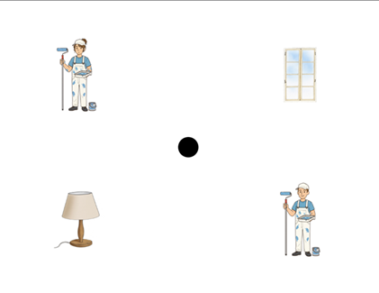

## Rezultati analize 

Na osnovu rada (1) nad podacima prikupljenim kroz psiholingvističku paradigu vizuelnog sveta sprovedena je longitudinalna analiza *Growth Curve Analysis*

Na osnovu vrednosti prikazanih u **gca_model_sumarry.txt** priećujemo sledeće glavne rezultate analize: 

📌 

<table>
<tr>
<td width="40%">

</td>

<td width="60%">

### primer eksperimentalnog ekrana

Četiri ilustracije su bile prikazivane na ekranu, uvek randomizovane: 
1) ilustracija zanimanja muškog pola
2) ilustracija zanimanja ženskog pola
3) predmet-objekat sadržan u eksperimentalnoj rečenici
4) distraktor predmet

</td>
</tr>
</table>

## Literatura

(1) Ito. A., Knoeferle P. 2022. Analysing data from the psycholinguistic visual‑world paradigm: Comparison of different analysis methods. *Behavior Research Methods*. **55**:3461–3493 