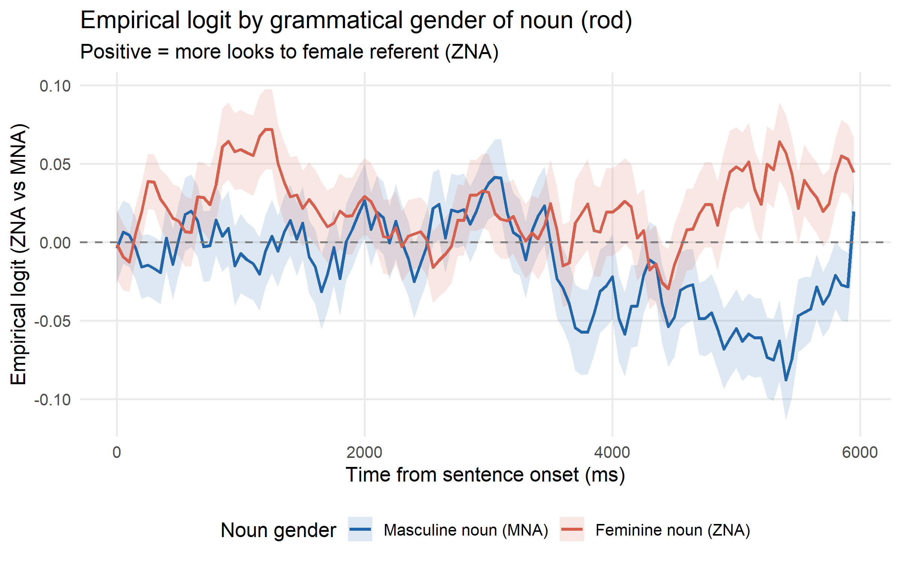
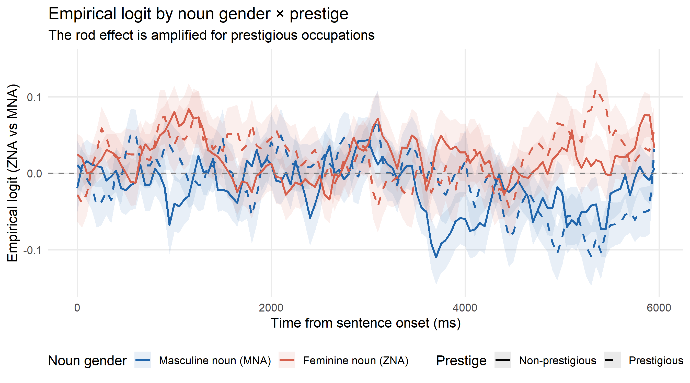
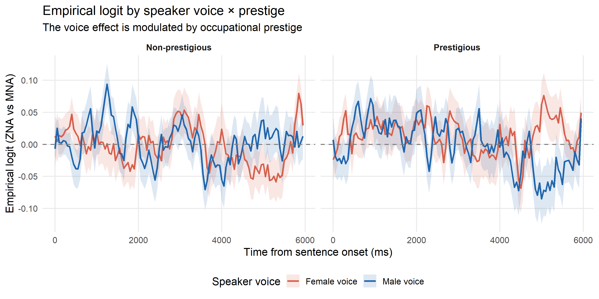

## Rezultati analize 

Na osnovu rada (1) nad podacima prikupljenim kroz psiholingvističku paradigmu vizuelnog sveta sprovedena je longitudinalna analiza *Growth Curve Analysis*.

Istraživačko pitanje: 

Kako:
1)  pol ispitanika
2)  rod imenice 
3)  glas kojim se imenica predstavlja 
4)  prestižnost predstavljenog zanimanja 

i(li) međusobna interakcija ovih faktora

utiču na pokrete očiju ispitanika govornika_ca srpskog jezika tokom auditivne obrade rečenica na srpskom jeziku?

Na osnovu vrednosti prikazanih u **gca_model_sumarry.txt** primećujemo sledeće glavne rezultate analize, navedene najpre one kod kojih sledeći faktori utiču i na linearni tok vremenske krive, ali i njen na oblik:

📌 Uticaj faktora **roda imenice**

<table>
<tr>
<td width="40%">

</td>

<td width="60%">

1) Efekat roda izgovorene imenice značajno (p < 0.01) utiče na linearnu (β = 0.379, SE = 0.047, t = 8.12), ali i kvadratnu* ( p < 0.01) vremensku krivu (β = 0.321, SE = 0.047, t = 6.83, p < .001), ukazujući na to da pogled prema referentu imenice muškog ili ženskog pola tokom toka rečenice statistički značajno prati rod izgovorene imenice.

*kvadratna kriva - _polynomial time curve_ in GCA

</td>
</tr>
</table>

---

📌 Uticaj interakcije faktora **roda i prestižnosti**

<table>
<tr>
<td width="40%">

</td>

<td width="60%">

2) Interakcija faktora roda i presižnosti značajno (p < 0.01; p < 0.01) utiče na linearnu (β = 0.379, SE = 0.047, t = 8.12) i kvadratnu (β = 0.321, SE = 0.047, t = 6.83, p < .001) krivu, tako da se preferenca ka prestižnim referentima ranije i jače javlja kod imenica muškog roda.

</td>
</tr>
</table>

---

</td>
</tr>
</table>

📌 Interakcija faktora  **glasa i prestižnosti**

<table>
<tr>
<td width="40%">

</td>

<td width="60%">

1) Interakcija faktora glasa i prestižnosti značajno utiče na linearnu (β = 0.456, SE = 0.089, t = 5.10, p < .001), kao i na kvadratnu komponentu (β = 0.210, SE = 0.090, t = 2.33, p = .020) vremenske krive, tako da postoji značajna tendencija gledanja u ženskog referenta kod prestižnih zanimanja izgovorenih ženskim glasom, kao i u muškog referenta kod presižnog zanimanja izgovorenim muškim glasom. 

</td>
</tr>
</table>

---

**Kratki komentari o globalno značajnim statičkim faktorima i njihove interakcijama**

Nezavisno od vremeskog toka izlaganja stimulusu, na globalnom nivou su se sledeći faktori pokazali značajnim: 

1. Gramatički rod (β = 0.058, SE = 0.028, t = 2.09, p = .042), tako da je pogled ka referentu jednog ili drugog pola značajno bio kongruentan sa rodom izgovorene imenice.

2. Interakcija roda i pola pokazala se značajnom (β = −0.027, SE = 0.008, t = −3.22, p = .001) tokom čitave rečenice, tako da su ispitanice više gledale u referente ženskog pola, a muškarci više u one muškog.

3. Interakcija faktora glasa kojim je izgovarana rečenica i pola ispitanika bila je značajna (β = −0.038, SE = 0.008, t = −4.56, p < .001), tako da su žene u muške referente gledale više kada ih izgovara muški glas, kao i muškarci kada ih izgovara ženski glas. 

4. I nezavisno od vremenskog razvoja rečenice, statistički značajno interaguju faktori prestižnosti zanimanja i pola ispitanika 
(β = 0.089, SE = 0.008, t = 10.61, p < .001), tako da ispitanice pokazuju izraženiju tendenciju ka ženskom referentu kod neprestižnih zanimanja, a muškarci, neočekivano, ka ženskim referentima kod muških zanimanja. 
Ovaj rezultat se može interpretirati u svetu internalizacije rodne stereotipizacije u kontekstu rodnih uloga, ali i dalje ispitati na većem i ujednačenijem rodnom uzorku.

---

**Predlog budućeg rada**

Kako na osnovu GCA modela dobijamo informaciju o tome da li manipulisani faktori značajno utiču na tendenciju pogleda tokom vremenskog perioda praćenja pogleda, kao i jačinu tog efekta, sledeći korak u ovoj analizi bi bio sprovesti analizu koja bi pokazala i tačno u kom vremenskom trenutku dolazi do efekta faktora, te ukrstiti ova dva rezultata. Model kojim bi se dalje moglo analizirati mogao bi biti CPA (cluster based permutation analysis) (Ito et al. 2022).

## Literatura

(1) Ito. A., Knoeferle P. 2022. Analysing data from the psycholinguistic visual‑world paradigm: Comparison of different analysis methods. *Behavior Research Methods*. **55**: 3461–3493 
